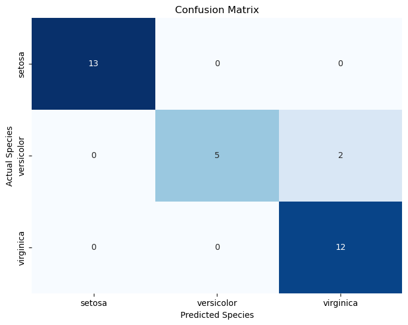

# Random-Forest

## Introduction

Random Forest is a powerful ensemble machine learning algorithm used for both regression and classification tasks. It's widely used in data science and has several advantages, including high accuracy, resistance to overfitting, and robustness with complex datasets.

This README provides an overview of Random Forest, its principles, and a practical example using Python and scikit-learn.

## Table of Contents

1. [Principles of Random Forest](#principles-of-random-forest)
2. [Example](#example)
3. [Installation](#installation)
4. [Usage](#usage)
5. [Contributing](#contributing)


## Principles of Random Forest

Random Forest is based on the concept of ensemble learning, where multiple models are combined to improve overall predictive performance. Here's how Random Forest works:

- **Decision Trees**: Random Forest builds multiple decision trees during training. Each tree is constructed based on a random subset of the training data and a random subset of the features.

- **Bagging**: The process of building multiple trees on different subsets of data is known as Bagging (Bootstrap Aggregating). This reduces overfitting and increases the model's generalization.

- **Voting**: For classification tasks, each decision tree "votes" for the class it predicts. The class with the most votes becomes the final prediction.

- **Averaging (Regression)**: For regression tasks, the predicted values from all trees are averaged to produce the final prediction.

- **Feature Importance**: Random Forest can provide information about feature importance, helping to identify which features have the most impact on predictions.

## Example

Let's demonstrate Random Forest with a Python example using the Iris dataset.

```python
#import libarary
import numpy as np
import pandas as pd
#import dataset from iris dataset
from sklearn.datasets import load_iris
from sklearn.ensemble import RandomForestClassifier
np.random.seed(0)
```


```python
#create an object iris from load_iris
iris = load_iris()
#create a dataframe
df = pd.DataFrame(iris.data, columns= iris.feature_names)
df.head()
```


<div>
<style scoped>
    .dataframe tbody tr th:only-of-type {
        vertical-align: middle;
    }

    .dataframe tbody tr th {
        vertical-align: top;
    }

    .dataframe thead th {
        text-align: right;
    }
</style>
<table border="1" class="dataframe">
  <thead>
    <tr style="text-align: right;">
      <th></th>
      <th>sepal length (cm)</th>
      <th>sepal width (cm)</th>
      <th>petal length (cm)</th>
      <th>petal width (cm)</th>
    </tr>
  </thead>
  <tbody>
    <tr>
      <th>0</th>
      <td>5.1</td>
      <td>3.5</td>
      <td>1.4</td>
      <td>0.2</td>
    </tr>
    <tr>
      <th>1</th>
      <td>4.9</td>
      <td>3.0</td>
      <td>1.4</td>
      <td>0.2</td>
    </tr>
    <tr>
      <th>2</th>
      <td>4.7</td>
      <td>3.2</td>
      <td>1.3</td>
      <td>0.2</td>
    </tr>
    <tr>
      <th>3</th>
      <td>4.6</td>
      <td>3.1</td>
      <td>1.5</td>
      <td>0.2</td>
    </tr>
    <tr>
      <th>4</th>
      <td>5.0</td>
      <td>3.6</td>
      <td>1.4</td>
      <td>0.2</td>
    </tr>
  </tbody>
</table>
</div>


```python
#Adding new column for the species name
df['species'] = pd.Categorical.from_codes(iris.target, iris.target_names)
df.head()
```


<div>
<style scoped>
    .dataframe tbody tr th:only-of-type {
        vertical-align: middle;
    }

    .dataframe tbody tr th {
        vertical-align: top;
    }

    .dataframe thead th {
        text-align: right;
    }
</style>
<table border="1" class="dataframe">
  <thead>
    <tr style="text-align: right;">
      <th></th>
      <th>sepal length (cm)</th>
      <th>sepal width (cm)</th>
      <th>petal length (cm)</th>
      <th>petal width (cm)</th>
      <th>species</th>
    </tr>
  </thead>
  <tbody>
    <tr>
      <th>0</th>
      <td>5.1</td>
      <td>3.5</td>
      <td>1.4</td>
      <td>0.2</td>
      <td>setosa</td>
    </tr>
    <tr>
      <th>1</th>
      <td>4.9</td>
      <td>3.0</td>
      <td>1.4</td>
      <td>0.2</td>
      <td>setosa</td>
    </tr>
    <tr>
      <th>2</th>
      <td>4.7</td>
      <td>3.2</td>
      <td>1.3</td>
      <td>0.2</td>
      <td>setosa</td>
    </tr>
    <tr>
      <th>3</th>
      <td>4.6</td>
      <td>3.1</td>
      <td>1.5</td>
      <td>0.2</td>
      <td>setosa</td>
    </tr>
    <tr>
      <th>4</th>
      <td>5.0</td>
      <td>3.6</td>
      <td>1.4</td>
      <td>0.2</td>
      <td>setosa</td>
    </tr>
  </tbody>
</table>
</div>


```python
#creating test and train data
df['is_train']= np.random.uniform(0,1,len(df))<=.75
df.head()
```


<div>
<style scoped>
    .dataframe tbody tr th:only-of-type {
        vertical-align: middle;
    }

    .dataframe tbody tr th {
        vertical-align: top;
    }

    .dataframe thead th {
        text-align: right;
    }
</style>
<table border="1" class="dataframe">
  <thead>
    <tr style="text-align: right;">
      <th></th>
      <th>sepal length (cm)</th>
      <th>sepal width (cm)</th>
      <th>petal length (cm)</th>
      <th>petal width (cm)</th>
      <th>species</th>
      <th>is_train</th>
    </tr>
  </thead>
  <tbody>
    <tr>
      <th>0</th>
      <td>5.1</td>
      <td>3.5</td>
      <td>1.4</td>
      <td>0.2</td>
      <td>setosa</td>
      <td>True</td>
    </tr>
    <tr>
      <th>1</th>
      <td>4.9</td>
      <td>3.0</td>
      <td>1.4</td>
      <td>0.2</td>
      <td>setosa</td>
      <td>True</td>
    </tr>
    <tr>
      <th>2</th>
      <td>4.7</td>
      <td>3.2</td>
      <td>1.3</td>
      <td>0.2</td>
      <td>setosa</td>
      <td>True</td>
    </tr>
    <tr>
      <th>3</th>
      <td>4.6</td>
      <td>3.1</td>
      <td>1.5</td>
      <td>0.2</td>
      <td>setosa</td>
      <td>True</td>
    </tr>
    <tr>
      <th>4</th>
      <td>5.0</td>
      <td>3.6</td>
      <td>1.4</td>
      <td>0.2</td>
      <td>setosa</td>
      <td>True</td>
    </tr>
  </tbody>
</table>
</div>


```python
#creating dataframe with train rows and test rows
train, test =  df[df['is_train']== True], df[df['is_train']== False]
#Print the lenth of the Train and test dataframes
print("Length of the train dataframes:",len(train))
print("Length of the test dataframes:",len(test))

```

    Length of the train dataframes: 118
    Length of the test dataframes: 32
    


```python
#list of the features
features = df.columns[:4]
features
```


    Index(['sepal length (cm)', 'sepal width (cm)', 'petal length (cm)',
           'petal width (cm)'],
          dtype='object')


```python
#convert each spacies name into digits
y = pd.factorize(train['species'])[0]
y
```


    array([0, 0, 0, 0, 0, 0, 0, 0, 0, 0, 0, 0, 0, 0, 0, 0, 0, 0, 0, 0, 0, 0,
           0, 0, 0, 0, 0, 0, 0, 0, 0, 0, 0, 0, 0, 0, 0, 1, 1, 1, 1, 1, 1, 1,
           1, 1, 1, 1, 1, 1, 1, 1, 1, 1, 1, 1, 1, 1, 1, 1, 1, 1, 1, 1, 1, 1,
           1, 1, 1, 1, 1, 1, 1, 1, 1, 1, 1, 1, 1, 1, 2, 2, 2, 2, 2, 2, 2, 2,
           2, 2, 2, 2, 2, 2, 2, 2, 2, 2, 2, 2, 2, 2, 2, 2, 2, 2, 2, 2, 2, 2,
           2, 2, 2, 2, 2, 2, 2, 2], dtype=int64)


```python
#Create a random forest classifier
rf = RandomForestClassifier(n_jobs=2, random_state=0)
#train the classifier
rf.fit(train[features],y)
```


```python
#test dataset
rf.predict(test[features])
```


    array([0, 0, 0, 0, 0, 0, 0, 0, 0, 0, 0, 0, 0, 1, 1, 1, 2, 2, 1, 1, 2, 2,
           2, 2, 2, 2, 2, 2, 2, 2, 2, 2], dtype=int64)


```python
#viewing the predictive probabilities of the first 10 observation
rf.predict_proba(test[features])[0:10]
```


    array([[1.  , 0.  , 0.  ],
           [1.  , 0.  , 0.  ],
           [1.  , 0.  , 0.  ],
           [1.  , 0.  , 0.  ],
           [1.  , 0.  , 0.  ],
           [0.95, 0.05, 0.  ],
           [1.  , 0.  , 0.  ],
           [0.99, 0.01, 0.  ],
           [1.  , 0.  , 0.  ],
           [1.  , 0.  , 0.  ]])


```python
#mapping the names for the plants for each predicted plant class
preds = iris.target_names[rf.predict(test[features])]
preds[0:20]
```


    array(['setosa', 'setosa', 'setosa', 'setosa', 'setosa', 'setosa',
           'setosa', 'setosa', 'setosa', 'setosa', 'setosa', 'setosa',
           'setosa', 'versicolor', 'versicolor', 'versicolor', 'virginica',
           'virginica', 'versicolor', 'versicolor'], dtype='<U10')


```python
#viewing the actual species 
test['species'].head()
```


    7     setosa
    8     setosa
    10    setosa
    13    setosa
    17    setosa
    Name: species, dtype: category
    Categories (3, object): ['setosa', 'versicolor', 'virginica']


```python
#creating confusion matrix
confusion_matrix = pd.crosstab(test['species'], preds, rownames=['Actual Species'], colnames=['Predicted Species'])
confusion_matrix
```


<div>
<style scoped>
    .dataframe tbody tr th:only-of-type {
        vertical-align: middle;
    }

    .dataframe tbody tr th {
        vertical-align: top;
    }

    .dataframe thead th {
        text-align: right;
    }
</style>
<table border="1" class="dataframe">
  <thead>
    <tr style="text-align: right;">
      <th>Predicted Species</th>
      <th>setosa</th>
      <th>versicolor</th>
      <th>virginica</th>
    </tr>
    <tr>
      <th>Actual Species</th>
      <th></th>
      <th></th>
      <th></th>
    </tr>
  </thead>
  <tbody>
    <tr>
      <th>setosa</th>
      <td>13</td>
      <td>0</td>
      <td>0</td>
    </tr>
    <tr>
      <th>versicolor</th>
      <td>0</td>
      <td>5</td>
      <td>2</td>
    </tr>
    <tr>
      <th>virginica</th>
      <td>0</td>
      <td>0</td>
      <td>12</td>
    </tr>
  </tbody>
</table>
</div>


```python
import seaborn as sns
import matplotlib.pyplot as plt
# Create a heatmap to visualize the confusion matrix
plt.figure(figsize=(8, 6))
sns.heatmap(confusion_matrix, annot=True, cmap='Blues', fmt='d', cbar=False)
plt.title('Confusion Matrix')
plt.show()
```


    

    


```python
# Assuming you have your input data in a DataFrame
input_data = pd.DataFrame([[5.0, 3.6, 1.4, 2.0], [5.0, 3.6, 1.4, 2.0]], columns=['sepal length (cm)', 'sepal width (cm)', 'petal length (cm)', 'petal width (cm)'])

# Now, you can use these feature names for predictions
preds = iris.target_names[rf.predict(input_data)]
preds
```


    array(['setosa', 'setosa'], dtype='<U10')


```python

```

```

In this example, we use the Iris dataset, split it into training and testing sets, create a Random Forest Classifier, fit the model, make predictions, and calculate accuracy.

## Installation

You can install the required libraries using pip:

```bash
pip install scikit-learn pandas
```

## Usage

1. Clone this repository:

   ```bash
   git clone https://github.com/MrAkash920/Random-Forest.git
   ```

2. Navigate to the repository directory:

   ```bash
   cd Random-Forest
   ```

3. Run the example script:

   ```bash
   python Predict_Flower_Species_Using_Random_Forest.py
   ```

## Contributing

Contributions are welcome! If you'd like to improve this README or add more examples and explanations, please open an issue or submit a pull request.
